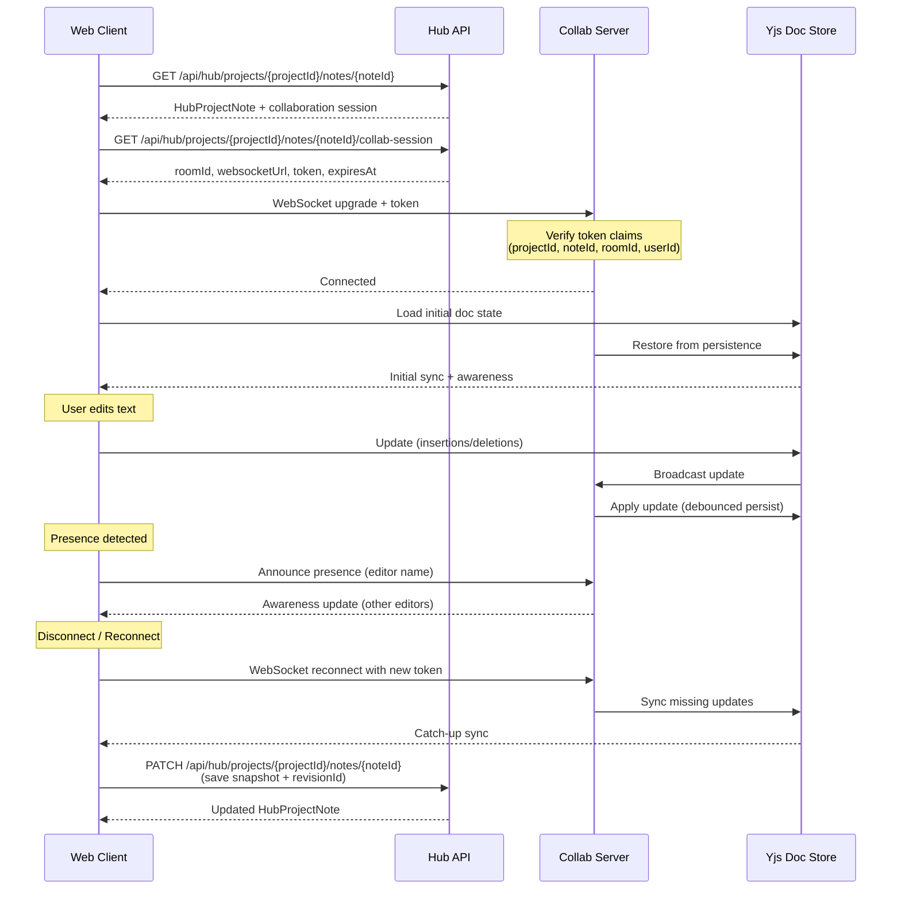

# CodeRabbit Comments Export (PR #1)

- Repository: EshaanSoood/eshaan-os
- PR: https://github.com/EshaanSoood/eshaan-os/pull/1
- Exported at: 2026-03-02 16:34:12 UTC
- Counts from GitHub API:
  - Conversation comments by CodeRabbit: 1
  - Inline review comments by CodeRabbit: 2
  - Review events by CodeRabbit: 1
  - Total entries exported: 4

## Review Events
### Review #3877238102
- Author: coderabbitai[bot]
- State: COMMENTED
- Submitted: 2026-03-02T16:26:22Z
- URL: https://github.com/EshaanSoood/eshaan-os/pull/1#pullrequestreview-3877238102

**Actionable comments posted: 2**

> [!NOTE]
> Due to the large number of review comments, Critical severity comments were prioritized as inline comments.

<details>
<summary>🟠 Major comments (27)</summary><blockquote>

<details>
<summary>apps/hub-api/Dockerfile-1-5 (1)</summary><blockquote>

`1-5`: _⚠️ Potential issue_ | _🟠 Major_

**Add a non-root user for improved container security.**

The container runs as root by default, which is a security risk. If the application is compromised, an attacker gains root privileges within the container. Static analysis (Trivy DS-0002) correctly flags this.

<details>
<summary>🔒 Proposed fix to add non-root user</summary>

```diff
 FROM node:22-alpine
 WORKDIR /app
 COPY hub-api.mjs /app/hub-api.mjs
+
+RUN addgroup -g 1001 -S nodejs && \
+    adduser -S nodejs -u 1001 -G nodejs && \
+    chown -R nodejs:nodejs /app
+
+USER nodejs
+
 EXPOSE 3001
 CMD ["node", "/app/hub-api.mjs"]
```
</details>

<details>
<summary>🤖 Prompt for AI Agents</summary>

```
Verify each finding against the current code and only fix it if needed.

In `@apps/hub-api/Dockerfile` around lines 1 - 5, The Dockerfile currently runs
the image as root (FROM node:22-alpine ... CMD ["node", "/app/hub-api.mjs"]);
create a non-root user and switch to it: add steps to create a group/user (e.g.,
app or nodeuser), chown the WORKDIR and copied file (hub-api.mjs) to that user,
and set USER to the non-root account before the EXPOSE/CMD so the node process
runs unprivileged; ensure the created user's home/permissions allow executing
/app/hub-api.mjs and keep existing WORKDIR, COPY, EXPOSE and CMD intact.
```

</details>

</blockquote></details>
<details>
<summary>apps/hub-collab/Dockerfile-1-8 (1)</summary><blockquote>

`1-8`: _⚠️ Potential issue_ | _🟠 Major_

**Drop root privileges before starting the collab server**

The container currently runs as root (no `USER` set). For an internet-exposed WebSocket service, this should run as a non-root user to reduce blast radius.


<details>
<summary>🔒 Proposed Dockerfile hardening</summary>

```diff
 FROM node:22-alpine
 WORKDIR /app
 COPY package.json /app/package.json
 COPY package-lock.json /app/package-lock.json
 RUN npm ci --omit=dev
-COPY collab-server.mjs /app/collab-server.mjs
+COPY --chown=node:node collab-server.mjs /app/collab-server.mjs
+RUN chown -R node:node /app
+USER node
 EXPOSE 1234
 CMD ["node", "/app/collab-server.mjs"]
```
</details>

<details>
<summary>🤖 Prompt for AI Agents</summary>

```
Verify each finding against the current code and only fix it if needed.

In `@apps/hub-collab/Dockerfile` around lines 1 - 8, The container runs as root;
create and switch to a non-root user before CMD to reduce blast radius: add
steps to create a dedicated user/group (eg. "collab" or similar), chown the app
directory and files (including /app, package.json, package-lock.json,
collab-server.mjs) to that user, and set USER to that non-root username so the
process started by CMD ["node","/app/collab-server.mjs"] runs unprivileged;
ensure any files that need write access are owned or writable by that user and
retain EXPOSE 1234.
```

</details>

</blockquote></details>
<details>
<summary>src/features/notes/lexicalState.ts-61-64 (1)</summary><blockquote>

`61-64`: _⚠️ Potential issue_ | _🟠 Major_

**Plain-text extraction currently breaks inline text into separate lines**

At Line 61–Line 64, joining every child text node with `'\n'` inserts line breaks between inline segments in the same paragraph. This will produce incorrect plain text (e.g., `"Hello"` + `" world"` becomes two lines).


<details>
<summary>🐛 Proposed fix</summary>

```diff
-  return root.children
-    .flatMap((node) => (Array.isArray(node.children) ? node.children : []))
-    .map((node) => (typeof node.text === 'string' ? node.text : ''))
-    .join('\n')
-    .trim();
+  return root.children
+    .map((node) =>
+      Array.isArray(node.children)
+        ? node.children
+            .map((child) => (typeof child.text === 'string' ? child.text : ''))
+            .join('')
+        : '',
+    )
+    .join('\n')
+    .trim();
 };
```
</details>

<details>
<summary>🤖 Prompt for AI Agents</summary>

```
Verify each finding against the current code and only fix it if needed.

In `@src/features/notes/lexicalState.ts` around lines 61 - 64, The current
extraction flattens all child text nodes and joins them with '\n', which inserts
line breaks between inline segments; change the logic to first concatenate text
of each root child’s children without separators (join('')) and then join those
per-block results with '\n' so inline segments in the same paragraph stay
together; specifically update the chain that uses root.children -> .flatMap(...
node.children ...) -> .map(node.text ...) to instead map over root.children, for
each child gather its node.children text pieces (checking
Array.isArray(node.children) and typeof node.text) and join them with '' before
finally joining the resulting block strings with '\n'.
```

</details>

</blockquote></details>
<details>
<summary>src/types/domain.ts-159-168 (1)</summary><blockquote>

`159-168`: _⚠️ Potential issue_ | _🟠 Major_

**Keep invite tokens out of the general record shape.**

`token` is a sensitive bearer secret. Making it a required field on `HubInviteRecord` increases the chance it gets returned, cached, or logged broadly.

<details>
<summary>🔐 Suggested modeling change</summary>

```diff
 export interface HubInviteRecord {
   id: string;
   email: string;
   projectId: string;
   membershipRole: ProjectMembership['role'];
   status: 'pending' | 'accepted' | 'revoked' | 'expired';
-  token: string;
   createdAt: string;
   expiresAt: string;
 }
+
+export interface HubInviteCreateResult extends HubInviteRecord {
+  token: string;
+}
```
</details>

<details>
<summary>🤖 Prompt for AI Agents</summary>

```
Verify each finding against the current code and only fix it if needed.

In `@src/types/domain.ts` around lines 159 - 168, The HubInviteRecord currently
includes the sensitive bearer secret "token"; remove "token" from the
HubInviteRecord interface so invite records cannot accidentally be returned or
logged, and introduce a separate type (e.g., HubInviteRecordWithToken or
HubInviteCreationResult) that carries the plain token only at creation time to
return to the caller; persist only a hashed token in storage (e.g., tokenDigest)
and update any creation functions (invite creation/issue functions) to return
the plain token via the new creation result type while all read/serialize paths
return HubInviteRecord without the token.
```

</details>

</blockquote></details>
<details>
<summary>apps/hub-collab/docker-compose.yml-4-9 (1)</summary><blockquote>

`4-9`: _⚠️ Potential issue_ | _🟠 Major_

**Avoid hardcoded absolute paths in Compose build/env config.**

These host-specific paths will break on any environment where the repo is checked out elsewhere (CI, teammate machines, different server layout).

<details>
<summary>🛠️ Suggested fix</summary>

```diff
-      context: /home/eshaan/deployments/eshaan-os-hub-collab
+      context: .
...
-      - /home/eshaan/deployments/eshaan-os-hub-collab/.env
+      - ./.env
```
</details>

<details>
<summary>🤖 Prompt for AI Agents</summary>

```
Verify each finding against the current code and only fix it if needed.

In `@apps/hub-collab/docker-compose.yml` around lines 4 - 9, The
docker-compose.yml currently uses host-specific absolute paths for the build
context and env_file (context: /home/eshaan/..., env_file: /home/eshaan/...),
which will break on other machines; change these to relative paths or
environment-interpolated values so the compose is portable: update the context
and dockerfile entries under the service build to use ./ (or a repo-relative
path) or ${PROJECT_DIR:-.} and replace the env_file absolute path with ./ .env
or ${ENV_FILE:-.env}; ensure container_name remains if needed but avoid
embedding host-specific directories in context or env_file (look for the keys
"context", "env_file", and "container_name" in the service definition to make
these replacements).
```

</details>

</blockquote></details>
<details>
<summary>scripts/calendar-nlp/corpus.test.mjs-6-9 (1)</summary><blockquote>

`6-9`: _⚠️ Potential issue_ | _🟠 Major_

**Hardcoded local corpus paths make this test fail in clean environments.**

Line 7–Line 8 reference machine-specific paths, and Line 20 hard-fails when they are absent. This will break CI or any checkout outside that laptop layout.


<details>
<summary>🧪 Suggested portable behavior</summary>

```diff
-const DEFAULT_CORPUS_PATHS = [
-  '/Users/eshaansood/eshaan-os/working files/data set 1.json',
-  '/Users/eshaansood/eshaan-os/working files/data set 2.json',
-];
+const DEFAULT_CORPUS_PATHS = [];

 const envPaths = (process.env.CALENDAR_NLP_CORPUS_PATHS || '')
   .split(',')
   .map((entry) => entry.trim())
   .filter(Boolean);

 const corpusPaths = envPaths.length > 0 ? envPaths : DEFAULT_CORPUS_PATHS;
 const availableCorpusPaths = corpusPaths.filter((entry) => existsSync(entry));

 test('calendar nlp corpus snapshots', async (t) => {
-  assert.ok(availableCorpusPaths.length > 0, 'No corpus files found. Set CALENDAR_NLP_CORPUS_PATHS to valid JSON files.');
+  if (availableCorpusPaths.length === 0) {
+    t.skip('No corpus files found. Set CALENDAR_NLP_CORPUS_PATHS to valid JSON files.');
+    return;
+  }
```
</details>


Also applies to: 16-21

<details>
<summary>🤖 Prompt for AI Agents</summary>

```
Verify each finding against the current code and only fix it if needed.

In `@scripts/calendar-nlp/corpus.test.mjs` around lines 6 - 9, The test currently
uses machine-specific hardcoded paths in DEFAULT_CORPUS_PATHS which causes
failures on other machines; update corpus.test.mjs to remove hardcoded absolute
paths in DEFAULT_CORPUS_PATHS and instead load paths from a portable source
(e.g., process.env.CORPUS_PATHS or discover files using a repo-relative
glob/fixture lookup), and change the failing branch that currently hard-exits
when no files are found to either skip the test or use an in-repo fixture/mock
corpus; ensure you update references to DEFAULT_CORPUS_PATHS and the code that
"hard-fails" when no corpus is present so CI and fresh checkouts don't break.
```

</details>

</blockquote></details>
<details>
<summary>scripts/deploy-hub-api.sh-26-30 (1)</summary><blockquote>

`26-30`: _⚠️ Potential issue_ | _🟠 Major_

**Apply the same SSH hardening here to avoid insecure/hanging deploys.**

Line 26–Line 30 have the same non-hardened SSH/rsync settings. Add strict host-key checking + batch mode + timeout for unattended runs.


<details>
<summary>🔐 Suggested hardening</summary>

```diff
+SSH_OPTS=(-i "$SSH_KEY_USE" -o BatchMode=yes -o IdentitiesOnly=yes -o StrictHostKeyChecking=yes -o ConnectTimeout=10)
+
 echo "Syncing Hub API deploy files..."
-ssh -i "$SSH_KEY_USE" "$DEPLOY_USER@$DEPLOY_HOST" "mkdir -p '$REMOTE_HUB_API_DIR'"
-rsync -avz -e "ssh -i $SSH_KEY_USE" "$LOCAL_HUB_API_DIR/" "$DEPLOY_USER@$DEPLOY_HOST:$REMOTE_HUB_API_DIR/"
+ssh "${SSH_OPTS[@]}" "$DEPLOY_USER@$DEPLOY_HOST" "mkdir -p '$REMOTE_HUB_API_DIR'"
+rsync -avz -e "ssh -i \"$SSH_KEY_USE\" -o BatchMode=yes -o IdentitiesOnly=yes -o StrictHostKeyChecking=yes -o ConnectTimeout=10" "$LOCAL_HUB_API_DIR/" "$DEPLOY_USER@$DEPLOY_HOST:$REMOTE_HUB_API_DIR/"

 echo "Building/restarting Hub API container..."
-ssh -i "$SSH_KEY_USE" "$DEPLOY_USER@$DEPLOY_HOST" "docker compose -f '$REMOTE_HUB_API_DIR/docker-compose.yml' up -d --build"
+ssh "${SSH_OPTS[@]}" "$DEPLOY_USER@$DEPLOY_HOST" "docker compose -f '$REMOTE_HUB_API_DIR/docker-compose.yml' up -d --build"
```
</details>

<details>
<summary>🤖 Prompt for AI Agents</summary>

```
Verify each finding against the current code and only fix it if needed.

In `@scripts/deploy-hub-api.sh` around lines 26 - 30, The SSH/rsync calls (the ssh
invocations and the rsync -e "ssh -i $SSH_KEY_USE" line) need SSH hardening to
avoid interactive/hanging deployments: add SSH options -o
StrictHostKeyChecking=yes -o BatchMode=yes -o ConnectTimeout=10 to every ssh and
to the ssh command used by rsync, and ensure the same $SSH_KEY_USE,
$DEPLOY_USER, $DEPLOY_HOST, $REMOTE_HUB_API_DIR and $LOCAL_HUB_API_DIR variables
are kept; update the two ssh invocations that run mkdir and docker compose and
the rsync -e subcommand to include these options so deployments fail fast and do
not prompt for host keys.
```

</details>

</blockquote></details>
<details>
<summary>scripts/deploy-collab.sh-26-30 (1)</summary><blockquote>

`26-30`: _⚠️ Potential issue_ | _🟠 Major_

**Harden SSH/rsync options for non-interactive deploy safety.**

Line 26–Line 30 run remote deploy commands without `StrictHostKeyChecking`, `BatchMode`, or connection timeouts. This weakens trust guarantees and can hang automation.


<details>
<summary>🔐 Suggested hardening</summary>

```diff
+SSH_OPTS=(-i "$SSH_KEY_USE" -o BatchMode=yes -o IdentitiesOnly=yes -o StrictHostKeyChecking=yes -o ConnectTimeout=10)
+
 echo "Syncing Hub collab deploy files..."
-ssh -i "$SSH_KEY_USE" "$DEPLOY_USER@$DEPLOY_HOST" "mkdir -p '$REMOTE_COLLAB_DIR'"
-rsync -avz -e "ssh -i $SSH_KEY_USE" "$LOCAL_COLLAB_DIR/" "$DEPLOY_USER@$DEPLOY_HOST:$REMOTE_COLLAB_DIR/"
+ssh "${SSH_OPTS[@]}" "$DEPLOY_USER@$DEPLOY_HOST" "mkdir -p '$REMOTE_COLLAB_DIR'"
+rsync -avz -e "ssh -i \"$SSH_KEY_USE\" -o BatchMode=yes -o IdentitiesOnly=yes -o StrictHostKeyChecking=yes -o ConnectTimeout=10" "$LOCAL_COLLAB_DIR/" "$DEPLOY_USER@$DEPLOY_HOST:$REMOTE_COLLAB_DIR/"

 echo "Building/restarting Hub collab container..."
-ssh -i "$SSH_KEY_USE" "$DEPLOY_USER@$DEPLOY_HOST" "docker compose -f '$REMOTE_COLLAB_DIR/docker-compose.yml' up -d --build"
+ssh "${SSH_OPTS[@]}" "$DEPLOY_USER@$DEPLOY_HOST" "docker compose -f '$REMOTE_COLLAB_DIR/docker-compose.yml' up -d --build"
```
</details>

<details>
<summary>🤖 Prompt for AI Agents</summary>

```
Verify each finding against the current code and only fix it if needed.

In `@scripts/deploy-collab.sh` around lines 26 - 30, The ssh/rsync invocations
(ssh -i "$SSH_KEY_USE" ... and rsync -e "ssh -i $SSH_KEY_USE" ...) lack
non-interactive and timeout options; update every occurrence (the two ssh calls
that run mkdir/docker compose and the rsync -e ssh wrapper) to include SSH
options such as -o BatchMode=yes -o ConnectTimeout=10 -o
StrictHostKeyChecking=accept-new (or StrictHostKeyChecking=yes with a managed
known_hosts file if preferred) so the commands fail fast and do not prompt for
host key verification during CI/automation.
```

</details>

</blockquote></details>
<details>
<summary>scripts/calendar-nlp/scratch-ui-server.mjs-223-226 (1)</summary><blockquote>

`223-226`: _⚠️ Potential issue_ | _🟠 Major_

**Add a request body size cap to prevent memory exhaustion.**

Line 224–Line 226 append incoming chunks without bounds. A large payload can consume excessive memory and kill the scratch server.


<details>
<summary>🛡️ Suggested fix</summary>

```diff
 const PORT = 8787;
+const MAX_BODY_BYTES = 1 * 1024 * 1024;
 const PARSE_CLI_PATH = fileURLToPath(new URL('./parse-cli.mjs', import.meta.url));
@@
     if (req.method === 'POST' && req.url === '/api/parse') {
       let body = '';
-      req.on('data', (chunk) => (body += chunk));
+      let bodyBytes = 0;
+      let tooLarge = false;
+      req.on('data', (chunk) => {
+        bodyBytes += chunk.length;
+        if (bodyBytes > MAX_BODY_BYTES) {
+          tooLarge = true;
+          res.writeHead(413, { 'Content-Type': 'application/json; charset=utf-8' });
+          res.end(JSON.stringify({ error: 'Payload too large' }));
+          req.destroy();
+          return;
+        }
+        body += chunk;
+      });
       req.on('end', () => {
+        if (tooLarge) return;
         try {
           const payload = JSON.parse(body || '{}');
```
</details>

<details>
<summary>🤖 Prompt for AI Agents</summary>

```
Verify each finding against the current code and only fix it if needed.

In `@scripts/calendar-nlp/scratch-ui-server.mjs` around lines 223 - 226, The POST
'/api/parse' request handler currently appends incoming chunks to body without
any limit, so add a maximum body size check (e.g., const MAX_BODY_BYTES =
<reasonable_number>) in the req.on('data', ...) callback used in the
'/api/parse' branch; incrementally track received bytes, and if the limit is
exceeded, stop processing by destroying/ending the request and respond with a
413 Payload Too Large (or similar) and an error message, ensuring the
req.on('end', ...) path is only reached when the body is within the allowed
size.
```

</details>

</blockquote></details>
<details>
<summary>src/components/auth/ProfilePanel.tsx-17-18 (1)</summary><blockquote>

`17-18`: _⚠️ Potential issue_ | _🟠 Major_

**Avoid sending user identifiers to third-party avatar services.**

Lines 17-18 derive the external avatar URL from user identity fields, which can leak PII/account identifiers.

<details>
<summary>🔐 Proposed fix (local initials avatar, no external request)</summary>

```diff
-  const avatarSeed = encodeURIComponent(sessionSummary.name || sessionSummary.email || sessionSummary.userId);
-  const avatarUrl = `https://api.dicebear.com/9.x/initials/svg?seed=${avatarSeed}`;
+  const displayName = sessionSummary.name || sessionSummary.email || 'User';
+  const initials = displayName
+    .split(/\s+/)
+    .filter(Boolean)
+    .map((part) => part[0]?.toUpperCase() ?? '')
+    .slice(0, 2)
+    .join('');
@@
-          
+          <div
+            aria-hidden="true"
+            className="flex h-24 w-24 items-center justify-center rounded-full border-4 border-surface bg-muted-subtle text-2xl font-semibold text-primary-strong"
+          >
+            {initials || 'U'}
+          </div>
```
</details>


Also applies to: 51-55

<details>
<summary>🤖 Prompt for AI Agents</summary>

```
Verify each finding against the current code and only fix it if needed.

In `@src/components/auth/ProfilePanel.tsx` around lines 17 - 18, The current code
builds avatarSeed and avatarUrl and sends user-identifying values to DiceBear;
change ProfilePanel to stop calling external avatar URLs (avatarSeed/avatarUrl)
and instead generate the initials avatar locally: compute safe initials from
sessionSummary.name || sessionSummary.email || sessionSummary.userId, render
them as an inline SVG data URL or as a styled div/span with background color and
initials, and use that local output wherever avatarUrl was used (e.g., Avatar
component or  src). Ensure no network call or external URL construction
uses the raw user identifiers.
```

</details>

</blockquote></details>
<details>
<summary>scripts/check-collab-preflight.mjs-37-40 (1)</summary><blockquote>

`37-40`: _⚠️ Potential issue_ | _🟠 Major_

**Strip optional surrounding quotes when reading `.env.production`.**

`readEnvValueFromFile()` returns raw values. If `VITE_HUB_COLLAB_WS_URL` is quoted, parity comparison fails even when URLs match.


<details>
<summary>Proposed fix</summary>

```diff
-      const value = trimmed.slice(separatorIndex + 1).trim();
+      const rawValue = trimmed.slice(separatorIndex + 1).trim();
+      const value = rawValue.replace(/^['"]|['"]$/g, '');
       if (name === key) {
         return value;
       }
```
</details>


Also applies to: 76-83

<details>
<summary>🤖 Prompt for AI Agents</summary>

```
Verify each finding against the current code and only fix it if needed.

In `@scripts/check-collab-preflight.mjs` around lines 37 - 40,
readEnvValueFromFile currently returns raw strings so quoted values (e.g.
"https://...") won't match; update the logic in readEnvValueFromFile to strip
optional surrounding single or double quotes from the parsed value before
returning (i.e., after computing value = trimmed.slice(...).trim(), remove
leading+trailing matching quotes) and apply the same quote-stripping change to
the other identical block around lines 76-83 that reads env values for
VITE_HUB_COLLAB_WS_URL so comparisons use unquoted canonical strings.
```

</details>

</blockquote></details>
<details>
<summary>scripts/check-collab-preflight.mjs-49-53 (1)</summary><blockquote>

`49-53`: _⚠️ Potential issue_ | _🟠 Major_

**Add timeout/abort handling to preflight health request.**

The current fetch can hang indefinitely under network issues, which makes CI/live preflight brittle.

<details>
<summary>🤖 Prompt for AI Agents</summary>

```
Verify each finding against the current code and only fix it if needed.

In `@scripts/check-collab-preflight.mjs` around lines 49 - 53, The request
function can hang because fetch has no timeout; update the async request(target)
to use an AbortController: create controller and a timeoutId (e.g., 5s), pass
controller.signal into fetch(target, { signal }), clear the timeout on success,
and handle abort/errors in the catch to return a deterministic result (for
example, status 0 or 408 and empty payload) instead of hanging; reference the
async function named request and the target parameter when making the changes.
```

</details>

</blockquote></details>
<details>
<summary>scripts/check-collab-ws-live.mjs-46-58 (1)</summary><blockquote>

`46-58`: _⚠️ Potential issue_ | _🟠 Major_

**HTTP helper should fail fast with a timeout.**

`request()` currently has no timeout, so API hangs can freeze the entire live check run.

<details>
<summary>🤖 Prompt for AI Agents</summary>

```
Verify each finding against the current code and only fix it if needed.

In `@scripts/check-collab-ws-live.mjs` around lines 46 - 58, The request helper
lacks a timeout and can hang; modify the request function to use an
AbortController: create a controller and pass controller.signal to fetch, start
a timer (e.g., TIMEOUT_MS) that calls controller.abort() when elapsed, and clear
the timer after fetch completes; also catch the abort/fetch error in request
(identify by the AbortError or error.name === 'AbortError') and return or throw
a clear timeout indication (e.g., a specific payload/status) so the live check
fails fast. Ensure you update the request(...) implementation (referenced as
request and hubBaseUrl) to include the AbortController, timeout logic, and
proper cleanup.
```

</details>

</blockquote></details>
<details>
<summary>scripts/check-hub-policy-live.mjs-20-32 (1)</summary><blockquote>

`20-32`: _⚠️ Potential issue_ | _🟠 Major_

**Add request timeouts to avoid indefinite hangs.**

`request()` has no timeout, so transient network hangs can block this script forever instead of failing fast.


<details>
<summary>Proposed fix</summary>

```diff
+const requestTimeoutMs = Number(process.env.HUB_REQUEST_TIMEOUT_MS || '15000');
+
 const request = async (path, { method = 'GET', token = '', body } = {}) => {
+  const controller = new AbortController();
+  const timer = setTimeout(() => controller.abort(), requestTimeoutMs);
   const response = await fetch(`${baseUrl}${path}`, {
     method,
+    signal: controller.signal,
     headers: {
       ...(token ? { Authorization: `Bearer ${token}` } : {}),
       ...(body ? { 'Content-Type': 'application/json' } : {}),
     },
     body: body ? JSON.stringify(body) : undefined,
   });
+  clearTimeout(timer);
 
   const payload = await response.json().catch(() => ({}));
   return { status: response.status, payload };
 };
```
</details>

<details>
<summary>🤖 Prompt for AI Agents</summary>

```
Verify each finding against the current code and only fix it if needed.

In `@scripts/check-hub-policy-live.mjs` around lines 20 - 32, The request function
can hang because fetch has no timeout; modify request to use an AbortController,
pass controller.signal to fetch, and set a timer (e.g., via setTimeout) that
calls controller.abort() after a configurable timeout (default a few seconds);
ensure you clear the timer once fetch resolves/rejects and handle the abort
error so request returns a deterministic error/status (or throws) instead of
hanging. Update references in request to use the new timeout option and ensure
body/stringify behavior stays the same.
```

</details>

</blockquote></details>
<details>
<summary>scripts/check-hub-tasks-local.mjs-10-10 (1)</summary><blockquote>

`10-10`: _⚠️ Potential issue_ | _🟠 Major_

**Add Node engine constraint to package.json for `node:sqlite` compatibility.**

The repository uses `DatabaseSync` from `node:sqlite` (lines 10 and 12 in the respective files) but neither `package.json` nor `apps/hub-collab/package.json` specifies Node version constraints. Since `node:sqlite` requires Node.js 22.0.0+, add an explicit `engines.node` field to ensure runtime compatibility and prevent failures on older Node versions.

<details>
<summary>🤖 Prompt for AI Agents</summary>

```
Verify each finding against the current code and only fix it if needed.

In `@scripts/check-hub-tasks-local.mjs` at line 10, The project imports
DatabaseSync from 'node:sqlite' which requires Node.js 22+, so add an explicit
engines.node constraint ">=22.0.0" to package.json and to
apps/hub-collab/package.json to ensure runtime compatibility; update the
top-level package.json and the apps/hub-collab package manifest to include an
"engines": { "node": ">=22.0.0" } entry (and optionally communicate this
requirement in README or CI), so environments running older Node versions will
fail fast.
```

</details>

</blockquote></details>
<details>
<summary>src/lib/calendar-nlp/passes/durationPass.ts-22-22 (1)</summary><blockquote>

`22-22`: _⚠️ Potential issue_ | _🟠 Major_

**Numeric day durations are currently not parsed.**

Line 22 omits `day(s)` tokens, so phrases like “for 2 days” are missed even though `parseDurationToMinutes` supports day units.


<details>
<summary>Proposed fix</summary>

```diff
-    regex: /\bfor\s+(\d+(?:\.\d+)?)\s*(hours?|hrs?|hr|h|minutes?|mins?|min|m)\b/gi,
+    regex: /\bfor\s+(\d+(?:\.\d+)?)\s*(days?|day|d|hours?|hrs?|hr|h|minutes?|mins?|min|m)\b/gi,
```
</details>

<details>
<summary>🤖 Prompt for AI Agents</summary>

```
Verify each finding against the current code and only fix it if needed.

In `@src/lib/calendar-nlp/passes/durationPass.ts` at line 22, The duration regex
in durationPass.ts currently misses day units so expressions like "for 2 days"
aren't matched; update the regex (the regex property in the duration pass) to
include day tokens (e.g., days?/d) alongside hours/minutes so matches include
"day" and "days" (keeping the existing numeric capture group and flags) ensuring
parseDurationToMinutes receives day units to convert.
```

</details>

</blockquote></details>
<details>
<summary>scripts/check-hub-tasks-local.mjs-408-412 (1)</summary><blockquote>

`408-412`: _⚠️ Potential issue_ | _🟠 Major_

**SIGKILL fallback won’t run reliably with current liveness check.**

After `hubChild.kill('SIGTERM')`, `hubChild.killed` becomes true once the signal is sent (not when exit occurs). So Line 410 does not actually test whether the process is still alive.


<details>
<summary>Proposed fix</summary>

```diff
 } finally {
   hubChild.kill('SIGTERM');
-  await new Promise((resolve) => setTimeout(resolve, 100));
-  if (!hubChild.killed) {
+  const exited = await Promise.race([
+    once(hubChild, 'exit').then(() => true),
+    new Promise((resolve) => setTimeout(() => resolve(false), 1000)),
+  ]);
+  if (!exited) {
     hubChild.kill('SIGKILL');
+    await once(hubChild, 'exit');
   }
   jwksServer.close();
   await once(jwksServer, 'close');
 }
```
</details>

<details>
<summary>🤖 Prompt for AI Agents</summary>

```
Verify each finding against the current code and only fix it if needed.

In `@scripts/check-hub-tasks-local.mjs` around lines 408 - 412, The current code
uses hubChild.killed to decide whether to escalate to SIGKILL, but
hubChild.killed becomes true as soon as the SIGTERM is sent, not when the
process has actually exited; replace the simple timeout + killed check with a
real liveness wait: after hubChild.kill('SIGTERM') await either the 'exit' event
on the child process (attach a one-time 'exit' listener and race it with a
timeout) or poll process.kill(hubChild.pid, 0) in a try/catch to verify the PID
is still alive; if the wait times out (process didn't emit 'exit' or
process.kill(pid,0) indicates the process is alive), then call
hubChild.kill('SIGKILL'). Use the existing hubChild variable and ensure you
remove listeners or clean up the timeout to avoid leaks.
```

</details>

</blockquote></details>
<details>
<summary>apps/hub-collab/collab-server.mjs-544-545 (1)</summary><blockquote>

`544-545`: _⚠️ Potential issue_ | _🟠 Major_

**Cap pre-document buffering to avoid per-connection memory exhaustion.**

`pendingMsgs` grows unbounded while waiting for `getDoc(room)`. A slow restore plus a noisy client can exhaust memory.


<details>
<summary>🛡️ Suggested mitigation</summary>

```diff
   let docReady = false;
   let pendingMsgs = [];
+  let pendingBytes = 0;
+  const MAX_PENDING_MSGS = 128;
+  const MAX_PENDING_BYTES = 1_048_576; // 1 MiB
@@
     if (!docReady) {
+      if (pendingMsgs.length >= MAX_PENDING_MSGS || pendingBytes + asUint8.byteLength > MAX_PENDING_BYTES) {
+        try {
+          conn.close(1009, 'message_buffer_limit');
+        } catch {
+          // ignore
+        }
+        return;
+      }
       pendingMsgs.push(asUint8);
+      pendingBytes += asUint8.byteLength;
@@
     for (const bufferedMessage of pendingMsgs) {
       processInboundMessage(bufferedMessage);
     }
     pendingMsgs = [];
+    pendingBytes = 0;
```
</details>


Also applies to: 567-587, 658-668

<details>
<summary>🤖 Prompt for AI Agents</summary>

```
Verify each finding against the current code and only fix it if needed.

In `@apps/hub-collab/collab-server.mjs` around lines 544 - 545, pendingMsgs
currently grows unbounded while waiting for getDoc(room); add a fixed cap (e.g.
const MAX_PENDING_MSGS = 1000) and enforce it wherever pendingMsgs is appended
(the variable named pendingMsgs used around getDoc(room) and the message
handling paths), rejecting or dropping oldest messages when the cap is reached
and optionally sending an error/close signal to the client or pausing reads (set
connectionClosed or emit a backpressure response). Ensure the push/append logic
checks pendingMsgs.length before adding, and centralize the cap behavior
(dropOldest or respondWithTooManyRequests) so identical protection is applied in
the other mentioned spots (the handlers around getDoc(room) and the other
message buffer sections).
```

</details>

</blockquote></details>
<details>
<summary>apps/hub-collab/collab-server.mjs-13-24 (1)</summary><blockquote>

`13-24`: _⚠️ Potential issue_ | _🟠 Major_

**Validate numeric env vars before applying limits and intervals.**

`Number(...)` without finite/range checks allows `NaN`/`0`/negative values, which can effectively disable guardrails (`maxConnections`, `maxDocuments`) or create aggressive ping behavior.


<details>
<summary>🔧 Suggested hardening</summary>

```diff
+const parsePositiveInt = (value, fallback, minimum = 1) => {
+  const parsed = Number(value);
+  if (!Number.isFinite(parsed) || parsed < minimum) {
+    return fallback;
+  }
+  return Math.floor(parsed);
+};
+
-const HUB_COLLAB_MAX_CONNECTIONS = Number(process.env.HUB_COLLAB_MAX_CONNECTIONS || '250');
-const HUB_COLLAB_MAX_DOCUMENTS = Number(process.env.HUB_COLLAB_MAX_DOCUMENTS || '500');
+const HUB_COLLAB_MAX_CONNECTIONS = parsePositiveInt(process.env.HUB_COLLAB_MAX_CONNECTIONS || '250', 250, 1);
+const HUB_COLLAB_MAX_DOCUMENTS = parsePositiveInt(process.env.HUB_COLLAB_MAX_DOCUMENTS || '500', 500, 1);
@@
-const HUB_COLLAB_PING_TIMEOUT_MS = Number(process.env.HUB_COLLAB_PING_TIMEOUT_MS || '30000');
+const HUB_COLLAB_PING_TIMEOUT_MS = parsePositiveInt(process.env.HUB_COLLAB_PING_TIMEOUT_MS || '30000', 30_000, 1_000);
```
</details>

<details>
<summary>🤖 Prompt for AI Agents</summary>

```
Verify each finding against the current code and only fix it if needed.

In `@apps/hub-collab/collab-server.mjs` around lines 13 - 24, The numeric env vars
(HUB_COLLAB_MAX_CONNECTIONS, HUB_COLLAB_MAX_DOCUMENTS,
HUB_COLLAB_PING_TIMEOUT_MS, PORT) are parsed with Number(...) but not validated,
allowing NaN/0/negative values; update the parsing to validate with
Number.isFinite and clamp to safe ranges/defaults (e.g., ensure PORT is a finite
positive integer fallback to 1234, HUB_COLLAB_MAX_CONNECTIONS and
HUB_COLLAB_MAX_DOCUMENTS are finite integers within sensible min/max bounds and
default if invalid, and HUB_COLLAB_PING_TIMEOUT_MS is a finite positive integer
with a minimum threshold), and centralize this logic so the variables are
assigned only after validation/clamping.
```

</details>

</blockquote></details>
<details>
<summary>src/lib/calendar-nlp/passes/recurrencePass.ts-455-487 (1)</summary><blockquote>

`455-487`: _⚠️ Potential issue_ | _🟠 Major_

**Gate `except ...` parsing to recurrence context and merge exceptions across matches.**

Current behavior can set `recurrence.exceptions` for non-recurring text, and each match overwrites prior exception dates.


<details>
<summary>🔧 Suggested fix</summary>

```diff
 const runExceptionRule = (ctx: ParseContext): void => {
+  if (!ctx.result.fields.recurrence.frequency && !RECURRENCE_SIGNAL_REGEX.test(ctx.rawInput)) {
+    return;
+  }
+
   const regex =
     /\bexcept\s+(.+?)(?=(?:\s+\b(?:until|ending|remind|alert|with|every|for|at|on|from|to|starting|start)\b|[,.;]|$))/gi;
@@
-    ctx.result.fields.recurrence.exceptions = dates;
+    const merged = new Set(ctx.result.fields.recurrence.exceptions ?? []);
+    for (const date of dates) {
+      merged.add(date);
+    }
+    ctx.result.fields.recurrence.exceptions = Array.from(merged);
```
</details>

<details>
<summary>🤖 Prompt for AI Agents</summary>

```
Verify each finding against the current code and only fix it if needed.

In `@src/lib/calendar-nlp/passes/recurrencePass.ts` around lines 455 - 487,
runExceptionRule currently unconditionally writes
ctx.result.fields.recurrence.exceptions and overwrites prior matches, and can
add exceptions even when no recurrence exists; update runExceptionRule so it
first checks that a recurrence field exists on ctx.result.fields (only proceed
if a recurring event is present), accumulate dates across all regex matches and
merge them with any existing ctx.result.fields.recurrence.exceptions
(deduplicate before assigning), and only call addFieldSpan('recurrence', ...)
once if you added any new exception dates; use the existing helpers
isSpanAvailable and toIsoDate and ensure you append/merge into
ctx.result.fields.recurrence.exceptions rather than replacing it.
```

</details>

</blockquote></details>
<details>
<summary>src/context/ProjectsContext.tsx-21-41 (1)</summary><blockquote>

`21-41`: _⚠️ Potential issue_ | _🟠 Major_

**Guard `refreshProjects` against stale async writes after auth changes.**

An in-flight request can still call `setProjects` after sign-out, because this callback doesn’t cancel/ignore stale completions. That can surface project data in a signed-out state.


<details>
<summary>🔧 Suggested fix</summary>

```diff
-import { createContext, useCallback, useContext, useEffect, useMemo, useState } from 'react';
+import { createContext, useCallback, useContext, useEffect, useMemo, useRef, useState } from 'react';
@@
 export const ProjectsProvider = ({ children }: { children: React.ReactNode }) => {
   const { signedIn, accessToken } = useAuthz();
+  const refreshSeq = useRef(0);
@@
   const refreshProjects = useCallback(async () => {
+    const seq = ++refreshSeq.current;
     if (!signedIn || !accessToken) {
       setProjects([]);
       setError(undefined);
+      setLoading(false);
       return;
     }
@@
     try {
       const result = await listHubProjects(accessToken);
+      if (seq !== refreshSeq.current) {
+        return;
+      }
       if (result.error || !result.data) {
         setProjects([]);
         setError(result.error || 'Unable to load projects');
         return;
       }
@@
     } finally {
-      setLoading(false);
+      if (seq === refreshSeq.current) {
+        setLoading(false);
+      }
     }
   }, [accessToken, signedIn]);
```
</details>

<details>
<summary>🤖 Prompt for AI Agents</summary>

```
Verify each finding against the current code and only fix it if needed.

In `@src/context/ProjectsContext.tsx` around lines 21 - 41, The refreshProjects
async callback can write stale project state after auth changes; modify
refreshProjects to detect/cancel stale completions by capturing current auth
context before the await (e.g., store currentSignedIn/currentAccessToken or a
requestId/AbortController) and verify it after listHubProjects resolves (or
abort the fetch) before calling setProjects or setError; update the function
refs (refreshProjects, signedIn, accessToken, listHubProjects, setProjects,
setError, setLoading) so state updates only occur when the captured auth matches
the current auth or when the request wasn't aborted.
```

</details>

</blockquote></details>
<details>
<summary>scripts/check-authz-runtime.mjs-33-53 (1)</summary><blockquote>

`33-53`: _⚠️ Potential issue_ | _🟠 Major_

**Add a request timeout to prevent hanging runtime checks.**

Line 35 performs unbounded network waits. A stalled endpoint can block the entire authz runtime check indefinitely.


<details>
<summary>⏱️ Proposed fix</summary>

```diff
+const REQUEST_TIMEOUT_MS = 15_000;
+
 const requestJson = async (path, { method = 'GET', token = '', body } = {}) => {
+  const controller = new AbortController();
+  const timeoutHandle = setTimeout(() => controller.abort(), REQUEST_TIMEOUT_MS);
   try {
     const response = await fetch(`${hubBaseUrl}${path}`, {
       method,
+      signal: controller.signal,
       headers: {
         ...(token ? { Authorization: `Bearer ${token}` } : {}),
         ...(body !== undefined ? { 'Content-Type': 'application/json' } : {}),
       },
       body: body === undefined ? undefined : JSON.stringify(body),
@@
   } catch (error) {
     return {
       status: -1,
       payload: null,
       networkError: error instanceof Error ? error.message : 'unknown network error',
     };
+  } finally {
+    clearTimeout(timeoutHandle);
   }
 };
```
</details>

<details>
<summary>🤖 Prompt for AI Agents</summary>

```
Verify each finding against the current code and only fix it if needed.

In `@scripts/check-authz-runtime.mjs` around lines 33 - 53, The requestJson
function currently does unbounded fetches; add a request timeout using
AbortController: create an AbortController, pass controller.signal into fetch
options, start a timer (e.g., configurable default like 5000ms) that calls
controller.abort(), and clear the timer after fetch completes; update the catch
branch to recognize an aborted request (AbortError) and return status -1 with
payload null and a networkError like 'request timed out' (or include
error.message), and ensure the controller and timer are cleaned up in all paths;
modify requestJson to accept an optional timeout parameter if needed.
```

</details>

</blockquote></details>
<details>
<summary>src/pages/ProjectPage.tsx-216-223 (1)</summary><blockquote>

`216-223`: _⚠️ Potential issue_ | _🟠 Major_

**Locked state is immediately cleared, defeating the reload gate.**

Lines 216-223 auto-reset `editorLocked` to `false`, so the lock does not persist long enough to enforce the intended "reload required" flow.


<details>
<summary>🔒 Proposed fix</summary>

```diff
-    if (editorLocked && canEditNotes) {
-      const timerId = window.setTimeout(() => {
-        setEditorLocked(false);
-      }, 0);
-      return () => {
-        window.clearTimeout(timerId);
-      };
-    }
```
</details>

<details>
<summary>🤖 Prompt for AI Agents</summary>

```
Verify each finding against the current code and only fix it if needed.

In `@src/pages/ProjectPage.tsx` around lines 216 - 223, The effect currently
auto-unlocks editorLocked by scheduling setEditorLocked(false) via a zero-delay
timer whenever editorLocked && canEditNotes is true, which immediately clears
the reload gate; remove the window.setTimeout/clearTimeout logic and stop
auto-resetting editorLocked in this effect — instead leave editorLocked true
until an explicit action (e.g., successful reload confirmation or an explicit
unlock handler) calls setEditorLocked(false); locate the effect referencing
editorLocked, canEditNotes, and setEditorLocked in ProjectPage (around the block
shown) and change it so it does not auto-clear the lock.
```

</details>

</blockquote></details>
<details>
<summary>src/lib/calendar-nlp/passes/chronoPass.ts-900-916 (1)</summary><blockquote>

`900-916`: _⚠️ Potential issue_ | _🟠 Major_

**Validate real calendar dates before accepting month/day fallback.**

Line 904 only checks numeric bounds, so impossible dates (for example, February 31) can still be emitted into `ctx.result.fields.date`.


<details>
<summary>📅 Proposed fix</summary>

```diff
   for (const match of matches) {
     const monthToken = (match[1] || '').toLowerCase();
     const month = MONTH_INDEX[monthToken];
     const day = Number(match[2] || '0');
     if (!month || !Number.isInteger(day) || day < 1 || day > 31) {
       continue;
     }

     let year = Number(match[3] || String(localNow.year));
     if (!Number.isInteger(year) || year < 1000) {
       year = localNow.year;
     }
+
+    const calendarDate = new Date(Date.UTC(year, month - 1, day));
+    const isValidCalendarDate =
+      calendarDate.getUTCFullYear() === year &&
+      calendarDate.getUTCMonth() === month - 1 &&
+      calendarDate.getUTCDate() === day;
+    if (!isValidCalendarDate) {
+      continue;
+    }

     let iso = toIsoDate(year, month, day);
```
</details>

</blockquote></details>
<details>
<summary>src/features/notes/CollaborativeLexicalEditor.tsx-134-185 (1)</summary><blockquote>

`134-185`: _⚠️ Potential issue_ | _🟠 Major_

**Avoid provider teardown/reconnect on every parent re-render.**

This effect depends on `onConnectionStatusChange` and `onPresenceChange`. In `src/pages/ProjectPage.tsx` (lines 697-702), those callbacks are created inline, so the effect re-runs and disconnects/destroys the provider repeatedly during parent re-renders.

<details>
<summary>♻️ Proposed fix</summary>

```diff
 export const CollaborativeLexicalEditor = ({
@@
   const providerRef = useRef<WebsocketProvider | null>(null);
+  const connectionCbRef = useRef(onConnectionStatusChange);
+  const presenceCbRef = useRef(onPresenceChange);
+
+  useEffect(() => {
+    connectionCbRef.current = onConnectionStatusChange;
+    presenceCbRef.current = onPresenceChange;
+  }, [onConnectionStatusChange, onPresenceChange]);
@@
-      const applyPresence = () => {
+      const applyPresence = () => {
         const names = noteAwareNames(provider);
         const editorCount = Math.max(provider.awareness.getStates().size, 1);
-        onPresenceChange?.(editorCount, names);
+        presenceCbRef.current?.(editorCount, names);
       };
 
       const handleStatus = ({ status }: { status: CollabConnectionStatus }) => {
-        onConnectionStatusChange?.(status);
+        connectionCbRef.current?.(status);
       };
@@
-  }, [collaborationSession, onConnectionStatusChange, onPresenceChange]);
+  }, [collaborationSession]);
```
</details>

<details>
<summary>🤖 Prompt for AI Agents</summary>

```
Verify each finding against the current code and only fix it if needed.

In `@src/features/notes/CollaborativeLexicalEditor.tsx` around lines 134 - 185,
The effect in CollaborativeLexicalEditor that creates/tears down the
collaboration provider (see providerRef, attach, cleanup) is re-running whenever
the parent supplies new inline callbacks because onConnectionStatusChange and
onPresenceChange are in the dependency array; stop unnecessary teardown by
stabilizing those callbacks: remove them from the effect deps and instead read
them from refs (e.g., create onConnectionStatusChangeRef and onPresenceChangeRef
updated in a separate useEffect) or require callers to memoize handlers, then
use the refs inside handleStatus/handleAwarenessChange so the provider is
attached once and not destroyed/recreated on parent re-renders.
```

</details>

</blockquote></details>
<details>
<summary>src/services/projectsService.ts-147-159 (1)</summary><blockquote>

`147-159`: _⚠️ Potential issue_ | _🟠 Major_

**Don’t let NLP parsing errors block note retrieval.**

On **Line 148**, `parseEventInput(...)` runs before fetch; if it throws, the function returns `"Unable to load notes."` and never executes plain search. This should degrade to `normalizedQuery`, not fail the request.

<details>
<summary>💡 Proposed fix</summary>

```diff
-    if (normalizedQuery) {
-      const parseResult = parseEventInput(normalizedQuery, {
-        locale: typeof navigator !== 'undefined' ? navigator.language : 'en-US',
-        timezone:
-          typeof Intl !== 'undefined'
-            ? Intl.DateTimeFormat().resolvedOptions().timeZone || 'UTC'
-            : 'UTC',
-      });
-
-      if (!shouldFallbackToPlainSearch(parseResult) && parseResult.fields.title) {
-        effectiveQuery = parseResult.fields.title;
-      }
-    }
+    if (normalizedQuery) {
+      try {
+        const parseResult = parseEventInput(normalizedQuery, {
+          locale: typeof navigator !== 'undefined' ? navigator.language : 'en-US',
+          timezone:
+            typeof Intl !== 'undefined'
+              ? Intl.DateTimeFormat().resolvedOptions().timeZone || 'UTC'
+              : 'UTC',
+        });
+
+        if (!shouldFallbackToPlainSearch(parseResult) && parseResult.fields.title) {
+          effectiveQuery = parseResult.fields.title;
+        }
+      } catch {
+        // Fall back to plain search query on NLP/parser failures.
+        effectiveQuery = normalizedQuery;
+      }
+    }
```
</details>

<details>
<summary>🤖 Prompt for AI Agents</summary>

```
Verify each finding against the current code and only fix it if needed.

In `@src/services/projectsService.ts` around lines 147 - 159, parseEventInput(...)
can throw and currently aborts note retrieval; wrap the call to parseEventInput
in a try/catch around the block that computes parseResult (the code that uses
parseEventInput, shouldFallbackToPlainSearch and parseResult.fields.title) and
on any exception set effectiveQuery = normalizedQuery so the function falls back
to the plain search path instead of returning an error; keep the existing logic
that uses parseResult only when it succeeds and satisfies
shouldFallbackToPlainSearch(parseResult) and has parseResult.fields.title.
```

</details>

</blockquote></details>
<details>
<summary>src/lib/calendar-nlp/utils.ts-135-154 (1)</summary><blockquote>

`135-154`: _⚠️ Potential issue_ | _🟠 Major_

**Weekday extraction fails for non-English locales.**

When `getZonedDateTimeParts` is called with a non-English locale (e.g., `fr-FR`, `de-DE`), the formatter produces localized weekday tokens (`lun.`, `Mo`) that don't exist in `weekdayMap`. This causes line 153 to evaluate to `NaN`, triggering the error at lines 155–157.

Fix by using a separate formatter with hardcoded `en-US` locale for weekday extraction:

<details>
<summary>Proposed fix</summary>

```diff
 export const getZonedDateTimeParts = (date: Date, timezone: string, locale = 'en-US'): ZonedDateTimeParts => {
   const formatter = getFormatter(locale, timezone, {
     year: 'numeric',
     month: '2-digit',
     day: '2-digit',
     hour: '2-digit',
     minute: '2-digit',
     hourCycle: 'h23',
-    weekday: 'short',
   });
+  const weekdayFormatter = getFormatter('en-US', timezone, {
+    weekday: 'short',
+  });

   const parts = formatter.formatToParts(date);
-  const weekdayToken = (parts.find((part) => part.type === 'weekday')?.value || '').toLowerCase();
+  const weekdayToken = weekdayFormatter.formatToParts(date)
+    .find((part) => part.type === 'weekday')?.value?.toLowerCase() || '';
   const weekday = weekdayMap[weekdayToken] ?? weekdayMap[weekdayToken.slice(0, 3)] ?? NaN;
```
</details>

<details>
<summary>🤖 Prompt for AI Agents</summary>

```
Verify each finding against the current code and only fix it if needed.

In `@src/lib/calendar-nlp/utils.ts` around lines 135 - 154, getZonedDateTimeParts
currently reads the weekday from the localized formatter
(formatter.formatToParts) so weekdayToken can be in another language and not
found in weekdayMap, producing NaN; fix this by creating a separate formatter
that forces the English locale (e.g., const enFormatter = getFormatter('en-US',
timezone, { weekday: 'short' })) and use enFormatter.formatToParts(date) (or
extract only the weekday part from that parts array) to derive weekdayToken,
then map it via weekdayMap (weekdayMap[weekdayToken] ??
weekdayMap[weekdayToken.slice(0,3)] ?? NaN) so weekday extraction is stable
across locales in getZonedDateTimeParts.
```

</details>

</blockquote></details>

</blockquote></details>

---

<details>
<summary>ℹ️ Review info</summary>

**Configuration used**: defaults

**Review profile**: CHILL

**Plan**: Pro

<details>
<summary>📥 Commits</summary>

Reviewing files that changed from the base of the PR and between c367c5dbc5ccbe0fdd8210dde0cc51830502374b and dcadf7950a8c7f3710ce66cfcfda811ed03a0279.

</details>

<details>
<summary>⛔ Files ignored due to path filters (2)</summary>

* `apps/hub-collab/package-lock.json` is excluded by `!**/package-lock.json`
* `package-lock.json` is excluded by `!**/package-lock.json`

</details>

<details>
<summary>📒 Files selected for processing (91)</summary>

* `README.md`
* `apps/hub-api/Dockerfile`
* `apps/hub-api/docker-compose.yml`
* `apps/hub-api/hub-api.mjs`
* `apps/hub-collab/Dockerfile`
* `apps/hub-collab/collab-server.mjs`
* `apps/hub-collab/docker-compose.yml`
* `apps/hub-collab/package.json`
* `calendar-nlp-output-new.txt`
* `calendar-nlp-output.txt`
* `collab-live-runlog.txt`
* `docs/Projects New Plan.md`
* `docs/a11y-manual-qa.md`
* `docs/auth-report.md`
* `docs/collab-socket-contract.md`
* `docs/hub-auth-jwks-validation-2026-03-01.md`
* `docs/hub-db-migrations.md`
* `docs/jwks-regression-report.md`
* `docs/keycloak-auth-contract.md`
* `docs/keycloak-live-capture-2026-03-01.json`
* `docs/keycloak-live-scope-mappers-2026-03-01.json`
* `docs/security-hardening-runbook.md`
* `docs/security-verification-snapshot.md`
* `ed.hup`
* `eslint.config.js`
* `globals.css`
* `package.json`
* `scripts/calendar-nlp/batch-dump-to-txt.mjs`
* `scripts/calendar-nlp/corpus-harness.mjs`
* `scripts/calendar-nlp/corpus.test.mjs`
* `scripts/calendar-nlp/enhancements.test.mjs`
* `scripts/calendar-nlp/parse-cli.mjs`
* `scripts/calendar-nlp/scratch-textbox.mjs`
* `scripts/calendar-nlp/scratch-ui-server.mjs`
* `scripts/calendar-nlp/weekday-semantics.test.mjs`
* `scripts/check-authz-runtime.mjs`
* `scripts/check-collab-preflight.mjs`
* `scripts/check-collab-ws-live.mjs`
* `scripts/check-hub-policy-live.mjs`
* `scripts/check-hub-tasks-local.mjs`
* `scripts/check-nextcloud-live.mjs`
* `scripts/check-openproject-live.mjs`
* `scripts/cleanup-live-test-entities.mjs`
* `scripts/cleanup-nextcloud-test-files.mjs`
* `scripts/cleanup-openproject-test-work-packages.mjs`
* `scripts/deploy-collab.sh`
* `scripts/deploy-hub-api.sh`
* `scripts/deploy-postmark.sh`
* `scripts/deploy-root.sh`
* `scripts/keycloak-close-club.mjs`
* `scripts/keycloak-verify-closed.mjs`
* `src/components/auth/ProfilePanel.tsx`
* `src/components/layout/ProjectShell.tsx`
* `src/components/ui/AccessibleDialog.tsx`
* `src/context/AuthzContext.tsx`
* `src/context/ProjectsContext.tsx`
* `src/context/SmartWakeContext.tsx`
* `src/data/authzData.ts`
* `src/data/mockData.ts`
* `src/features/NotesPanel.tsx`
* `src/features/PersonalizedDashboardPanel.tsx`
* `src/features/ProjectCorePanel.tsx`
* `src/features/SmartWakePanel.tsx`
* `src/features/notes/CollaborativeLexicalEditor.tsx`
* `src/features/notes/EditorShell.tsx`
* `src/features/notes/lexicalState.ts`
* `src/features/notes/lexicalTheme.ts`
* `src/lib/blockingInputs.ts`
* `src/lib/calendar-nlp/README.md`
* `src/lib/calendar-nlp/constants.ts`
* `src/lib/calendar-nlp/index.ts`
* `src/lib/calendar-nlp/passes/alertsPass.ts`
* `src/lib/calendar-nlp/passes/attendeesPass.ts`
* `src/lib/calendar-nlp/passes/chronoPass.ts`
* `src/lib/calendar-nlp/passes/durationPass.ts`
* `src/lib/calendar-nlp/passes/locationPass.ts`
* `src/lib/calendar-nlp/passes/recurrencePass.ts`
* `src/lib/calendar-nlp/passes/titlePass.ts`
* `src/lib/calendar-nlp/types.ts`
* `src/lib/calendar-nlp/utils.ts`
* `src/lib/dashboardCards.ts`
* `src/lib/env.ts`
* `src/lib/serviceRegistry.ts`
* `src/main.tsx`
* `src/pages/LoginPage.tsx`
* `src/pages/ProjectPage.tsx`
* `src/pages/ProjectsPage.tsx`
* `src/services/hedgeDocService.ts`
* `src/services/projectsService.ts`
* `src/types/domain.ts`
* `tsconfig.app.json`

</details>

<details>
<summary>💤 Files with no reviewable changes (2)</summary>

* src/services/hedgeDocService.ts
* src/lib/blockingInputs.ts

</details>

</details>

<!-- This is an auto-generated comment by CodeRabbit for review status -->


## Conversation Comments
### Comment #3985372217
- Author: coderabbitai[bot]
- Created: 2026-03-02T16:18:36Z
- URL: https://github.com/EshaanSoood/eshaan-os/pull/1#issuecomment-3985372217

<!-- This is an auto-generated comment: summarize by coderabbit.ai -->
<!-- walkthrough_start -->

<details>
<summary>📝 Walkthrough</summary>

## Walkthrough

This PR introduces real-time collaborative note editing via a dedicated WebSocket-based Yjs collab server, transitions from HedgeDoc to hub-managed notes scoped to projects, adds a comprehensive calendar natural language parser with corpus-based testing, and includes extensive deployment automation, security hardening runbooks, and Hub API integration layer.

## Changes

|Cohort / File(s)|Summary|
|---|---|
|**Hub Collab Service** <br> `apps/hub-collab/*`|New WebSocket collaboration server (collab-server.mjs with token auth, Yjs doc persistence, health checks, Traefik routing) and Docker deployment configuration.|
|**Hub API Deployment** <br> `apps/hub-api/*`|New Hub API Docker image and Traefik-routed docker-compose configuration exposing port 3001 with HTTPS/gzip/routing rules.|
|**Frontend Collaboration Components** <br> `src/features/notes/*`|New CollaborativeLexicalEditor (Yjs + y-websocket integration), EditorShell (editor header/status UI), and lexical state utilities (normalization, plain text extraction, theme definitions).|
|**Projects Context & State** <br> `src/context/ProjectsContext.tsx`|New React context and provider for managing hub projects with loading/error states and refresh capability; ties authentication to project data fetch.|
|**Notes Panel Refactor** <br> `src/features/NotesPanel.tsx`|Replaced HedgeDoc-based notes with hub-scoped project notes; removed manual workflows, integrated project selection and listing via HTTP service.|
|**Project Page Enhancement** <br> `src/pages/ProjectPage.tsx`|Major refactor: added collaborative note editing UI, Lexical editor integration, real-time sync via collab server, note search/create/archive, revision tracking, and presence awareness; replaced Files/Automations placeholders with dynamic content.|
|**Hub API Integration Service** <br> `src/services/projectsService.ts`|New service layer providing HTTP-backed functions for projects, invites, notes (with NLP-based search), snapshots, recovery jobs, and collaboration sessions.|
|**Calendar NLP Library** <br> `src/lib/calendar-nlp/*`|Comprehensive parser with pluggable passes (alerts, attendees, chrono, duration, location, recurrence, title), corpus testing harness, CLI tools, and structured output with confidence/spans/debug metadata.|
|**Calendar NLP Tests & Tools** <br> `scripts/calendar-nlp/*`|Test modules (corpus.test, enhancements.test, weekday-semantics.test), CLI parser, interactive UI server, and batch output generation.|
|**Live Validation & Cleanup Scripts** <br> `scripts/check-*.mjs`, `scripts/cleanup-*.mjs`|New end-to-end validation scripts for authz, collab-preflight, collab-ws, hub-policy, hub-tasks-local, and Nextcloud/OpenProject live checks; cleanup scripts for test entities, files, and work-packages.|
|**Deployment Automation** <br> `scripts/deploy-*.sh`|New bash scripts for syncing and deploying hub-api and hub-collab services with SSH key handling and remote Docker Compose orchestration; updated deploy-postmark to delegate to hub-api.|
|**Keycloak Management Scripts** <br> `scripts/keycloak-*.mjs`|New scripts to close public registration and verify Keycloak realm state (disabling registration, confirming token denial).|
|**Security & Architecture Documentation** <br> `docs/*`|New docs covering security hardening runbook (6 phases: owner invariant, closed registration, direct-service bypass, audit/recovery, hub notes, collab socket), collab socket contract, hub DB migrations (v1-v3), JWKS validation, auth contract, and verification snapshots; includes Keycloak realm exports and scope mapper configs.|
|**Sample Data & Logs** <br> `calendar-nlp-output.txt`, `collab-live-runlog.txt`|New sample NLP parser outputs and live collaboration test run logs demonstrating token flows, WebSocket sync, reconnection, and cleanup.|
|**Projects Documentation** <br> `docs/Projects New Plan.md`|New plan outlining creator studio hub with SQLite-first providers, stable Hub API, phased implementation (Phases 1–6), and data model for projects, tasks, time tracking, and notifications.|
|**Accessibility Documentation** <br> `docs/a11y-manual-qa.md`|New manual accessibility QA checklist for keyboard-only flows, focus management, live announcements, landmarks, and Lexical editor interactions.|
|**Context & Type Updates** <br> `src/context/AuthzContext.tsx`, `src/types/domain.ts`|Added accessToken management to AuthzContext; introduced ProjectRecord type, new Hub domain types (invites, notes, snapshots, recovery jobs, collaboration session), and expanded SessionSummary (firstName, lastName).|
|**Component Updates** <br> `src/components/layout/ProjectShell.tsx`, `src/components/ui/AccessibleDialog.tsx`, `src/components/auth/ProfilePanel.tsx`|ProjectShell refactored to use ProjectRecord; AccessibleDialog enhanced with optional header hiding and custom styling props; ProfilePanel updated with avatar and project list rendering.|
|**Service Registry & Dashboard** <br> `src/lib/serviceRegistry.ts`, `src/lib/dashboardCards.ts`, `src/data/authzData.ts`|Removed HedgeDoc; added ownerOnlyExternalUi flag to services; introduced canAccessServiceExternalUi helper; updated notes card to point to /projects; added services.external.view capability.|
|**Styling & Configuration** <br> `globals.css`, `eslint.config.js`, `src/lib/env.ts`, `tsconfig.app.json`|Added hub-editor component styles (paragraphs, headings, lists, formatting); expanded eslint ignores for apps and docs; added hubCollabWsUrl/reconnectGraceMs to env; removed HedgeDoc env vars; enabled TS import extensions.|
|**Dependency Updates** <br> `package.json`|Added Lexical ecosystem (`@lexical/react`, `@lexical/link`, `@lexical/list`, `@lexical/markdown`, `@lexical/rich-text`, `@lexical/yjs`, lexical), Yjs, y-websocket, chrono-node, ws; added 20+ new npm scripts for testing, checking, deploying, and keycloak management; updated deploy pipeline to include hub-api and collab.|
|**Data & Context Updates** <br> `src/context/SmartWakeContext.tsx`, `src/data/mockData.ts`, `src/lib/blockingInputs.ts`, `src/features/PersonalizedDashboardPanel.tsx`|Removed HedgeDoc from sleep services; removed hedgeDocTeam from project mock data; removed VITE_HEDGEDOC env vars from blocking inputs; updated dashboard to use real ProjectsContext.|
|**Removed Service** <br> `src/services/hedgeDocService.ts`|Entire HedgeDoc service module removed (listNotes, createNote, archiveNoteToNextcloud); replaced by hub-managed notes via projectsService.|

## Sequence Diagram



## Estimated code review effort

🎯 4 (Complex) | ⏱️ ~60 minutes

---

## Poem

> 🐰 *Whispers from the Warren*
> 
> A collab server hops into place,
> Real-time notes at a quickened pace!
> Yjs weaves the edits together,
> While Lexical keeps the prose light as a feather.
> Calendar words parse into dates,
> And hub-managed notes seal the fates! 🎉

</details>

<!-- walkthrough_end -->


<!-- pre_merge_checks_walkthrough_start -->

<details>
<summary>🚥 Pre-merge checks | ✅ 2 | ❌ 1</summary>

### ❌ Failed checks (1 warning)

|     Check name     | Status     | Explanation                                                                          | Resolution                                                                         |
| :----------------: | :--------- | :----------------------------------------------------------------------------------- | :--------------------------------------------------------------------------------- |
| Docstring Coverage | ⚠️ Warning | Docstring coverage is 0.00% which is insufficient. The required threshold is 80.00%. | Write docstrings for the functions missing them to satisfy the coverage threshold. |

<details>
<summary>✅ Passed checks (2 passed)</summary>

|     Check name    | Status   | Explanation                                                                                                                                                                                                                                        |
| :---------------: | :------- | :------------------------------------------------------------------------------------------------------------------------------------------------------------------------------------------------------------------------------------------------- |
| Description Check | ✅ Passed | Check skipped - CodeRabbit’s high-level summary is enabled.                                                                                                                                                                                        |
|    Title check    | ✅ Passed | The PR title accurately describes the primary changes: snapshotting the current state and hardening ignore rules, which aligns with the extensive additions to documentation, deployment scripts, and feature implementations across the codebase. |

</details>

<sub>✏️ Tip: You can configure your own custom pre-merge checks in the settings.</sub>

</details>

<!-- pre_merge_checks_walkthrough_end -->

<!-- finishing_touch_checkbox_start -->

<details>
<summary>✨ Finishing Touches</summary>

- [ ] <!-- {"checkboxId": "7962f53c-55bc-4827-bfbf-6a18da830691"} --> 📝 Generate docstrings (stacked PR)
- [ ] <!-- {"checkboxId": "3e1879ae-f29b-4d0d-8e06-d12b7ba33d98"} --> 📝 Generate docstrings (commit on current branch)
<details>
<summary>🧪 Generate unit tests (beta)</summary>

- [ ] <!-- {"checkboxId": "f47ac10b-58cc-4372-a567-0e02b2c3d479", "radioGroupId": "utg-output-choice-group-unknown_comment_id"} -->   Create PR with unit tests
- [ ] <!-- {"checkboxId": "07f1e7d6-8a8e-4e23-9900-8731c2c87f58", "radioGroupId": "utg-output-choice-group-unknown_comment_id"} -->   Post copyable unit tests in a comment
- [ ] <!-- {"checkboxId": "6ba7b810-9dad-11d1-80b4-00c04fd430c8", "radioGroupId": "utg-output-choice-group-unknown_comment_id"} -->   Commit unit tests in branch `codex/prepare-pr-current-state`

</details>

</details>

<!-- finishing_touch_checkbox_end -->


<!-- tips_start -->

---


<sub>Comment `@coderabbitai help` to get the list of available commands and usage tips.</sub>

<!-- tips_end -->

<!-- internal state omitted -->


## Inline Review Comments
### Inline Comment #2873378495
- Author: coderabbitai[bot]
- File: collab-live-runlog.txt
- Line: 18
- Created: 2026-03-02T16:26:21Z
- URL: https://github.com/EshaanSoood/eshaan-os/pull/1#discussion_r2873378495

_⚠️ Potential issue_ | _🔴 Critical_

**Remove committed credentials and PII from this artifact before merge.**

This file includes sensitive data (emails, auth tokens, invite tokens, disposable passwords, user IDs). It should not be committed in plaintext logs.


<details>
<summary>🔒 Immediate remediation</summary>

```diff
- collab-live-runlog.txt
+ collab-live-runlog.txt (redacted)
```

- Purge/redact secrets and personal identifiers from this file.
- Rotate any exposed credentials/tokens.
- Keep live runlogs out of Git tracking (or commit only sanitized templates).
</details>


Also applies to: 41-43, 53-60

<details>
<summary>🤖 Prompt for AI Agents</summary>

```
Verify each finding against the current code and only fix it if needed.

In `@collab-live-runlog.txt` around lines 4 - 18, The committed runlog contains
sensitive PII and secrets (owner email, Owner token, /api/hub/me entries,
Project created/projectId, Note created/noteId, Invite created/inviteId/token,
Keycloak users userAId/userBId, Disposable passwords, User tokens) and must be
purged: remove this file from the commit or replace all sensitive values with
deterministic placeholders (e.g., <REDACTED_OWNER_EMAIL>,
<REDACTED_OWNER_TOKEN>, <REDACTED_PROJECT_ID>, <REDACTED_NOTE_ID>,
<REDACTED_INVITE_ID>, <REDACTED_INVITE_TOKEN>, <REDACTED_USER_ID>,
<REDACTED_PASSWORD>, <REDACTED_USER_TOKEN>), rotate any exposed
credentials/tokens immediately, add the runlog pattern to .gitignore or stop
logging secrets, and update CI/test helpers to write sanitized logs (or store
real secrets in a secrets manager) so future commits do not include live tokens
or PII.
```

</details>

<!-- fingerprinting:phantom:medusa:hawk -->

<!-- This is an auto-generated comment by CodeRabbit -->

### Inline Comment #2873378505
- Author: coderabbitai[bot]
- File: scripts/check-hub-tasks-local.mjs
- Line: 151
- Created: 2026-03-02T16:26:21Z
- URL: https://github.com/EshaanSoood/eshaan-os/pull/1#discussion_r2873378505

_⚠️ Potential issue_ | _🔴 Critical_

**Replace hard-coded absolute path for spawning hub-api.**

Line 151 uses `/Users/eshaansood/...`, which will fail on every other machine/CI environment.


<details>
<summary>Proposed fix</summary>

```diff
+import { fileURLToPath } from 'node:url';
+import { dirname, resolve } from 'node:path';
+
+const __filename = fileURLToPath(import.meta.url);
+const __dirname = dirname(__filename);
+const hubApiEntry = resolve(__dirname, '../apps/hub-api/hub-api.mjs');
+
-const hubChild = spawn('node', ['/Users/eshaansood/eshaan-os/apps/hub-api/hub-api.mjs'], {
+const hubChild = spawn('node', [hubApiEntry], {
```
</details>

<!-- suggestion_start -->

<details>
<summary>📝 Committable suggestion</summary>

> ‼️ **IMPORTANT**
> Carefully review the code before committing. Ensure that it accurately replaces the highlighted code, contains no missing lines, and has no issues with indentation. Thoroughly test & benchmark the code to ensure it meets the requirements.

```suggestion
import { fileURLToPath } from 'node:url';
import { dirname, resolve } from 'node:path';

const __filename = fileURLToPath(import.meta.url);
const __dirname = dirname(__filename);
const hubApiEntry = resolve(__dirname, '../apps/hub-api/hub-api.mjs');

const hubChild = spawn('node', [hubApiEntry], {
```

</details>

<!-- suggestion_end -->

<details>
<summary>🤖 Prompt for AI Agents</summary>

```
Verify each finding against the current code and only fix it if needed.

In `@scripts/check-hub-tasks-local.mjs` at line 151, The spawn call currently
hard-codes an absolute path to hub-api (const hubChild = spawn('node',
['/Users/eshaansood/.../hub-api.mjs'], ...)), which breaks on other machines;
replace the literal with a resolved path computed at runtime using
import.meta.url and path/fileURLToPath (get the current script directory,
resolve the relative path to apps/hub-api/hub-api.mjs) and pass that
resolvedPath into spawn (i.e., spawn('node', [resolvedPath], ...)) so hubChild
is started via a portable, repo-relative path.
```

</details>

<!-- fingerprinting:phantom:medusa:hawk -->

<!-- This is an auto-generated comment by CodeRabbit -->

